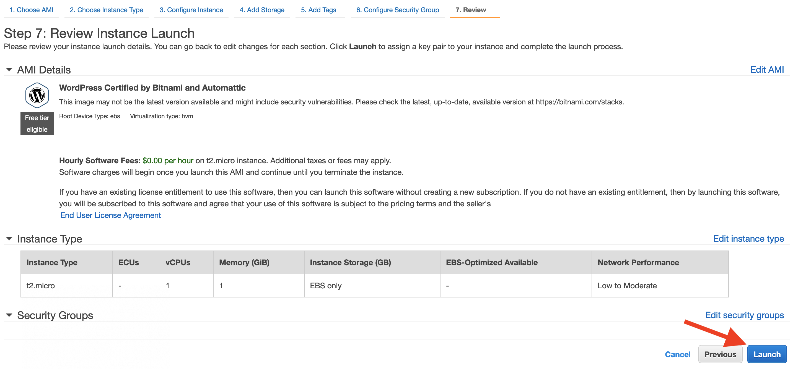

# Wordpress Migration Workshop
In this workshop, you will learn how to migrate a typical wordpress website to AWS.

## Intro to AWS

Amazon Web Services (AWS) is the world’s most comprehensive and broadly adopted cloud platform, offering over 200 fully featured services from data centers globally. Millions of customers—including the fastest-growing startups, largest enterprises, and leading government agencies—are using AWS to lower costs, become more agile, and innovate faster.

## What is migration?

A migration is when you move an application and data from one location to a new location.  

Migrations to AWS include moving any workload from an on-premises environment, hosting facility, or other public cloud. AWS is working with thousands of organizations to migrate workloads such as applications, websites, databases, storage, physical or virtual servers, or entire data centers.

## Intro to EC2

Amazon Elastic Compute Cloud (Amazon EC2) is a web service that provides secure, resizable compute capacity in the cloud. It is designed to make web-scale cloud computing easier for developers. Amazon EC2’s simple web service interface allows you to obtain and configure capacity with minimal friction. It provides you with complete control of your computing resources and lets you run on Amazon’s proven computing environment.

### Core Services
1. VPC
Amazon Virtual Private Cloud (Amazon VPC) enables you to launch AWS resources into a virtual network that you've defined. This virtual network closely resembles a traditional network that you'd operate in your own data center, with the benefits of using the scalable infrastructure of AWS. 

Amazon VPC concepts

Amazon VPC is the networking layer for Amazon EC2. 

The following are the key concepts for VPCs:

    Virtual private cloud (VPC) — A virtual network dedicated to your AWS account.

    Subnet — A range of IP addresses in your VPC.

    Route table — A set of rules, called routes, that are used to determine where network traffic is directed.

    Internet gateway — A gateway that you attach to your VPC to enable communication between resources in your VPC and the internet.

    VPC endpoint — Enables you to privately connect your VPC to supported AWS services and VPC endpoint services powered by PrivateLink without requiring an internet gateway, NAT device, VPN connection, or AWS Direct Connect connection. Instances in your VPC do not require public IP addresses to communicate with resources in the service. Traffic between your VPC and the other service does not leave the Amazon network. For more information, see AWS PrivateLink and VPC endpoints.

    CIDR block —Classless Inter-Domain Routing. An internet protocol address allocation and route aggregation methodology. For more information, see Classless Inter-Domain Routing in Wikipedia. 

2. EC2 (Instances)
3. Security -

## Parts of a Wordpress Website

Wordpress is a popular website management system and is used by millions of websites around the world. Wordpress consists of the following components
1. Server
This is the physical or virtual server
2. Web Server
This is an application that servers HTTP requests. Popular web servers are Apache and Nginx
3. Database
The database is where content, configuration, and user information is stored.  Wordpress supports common database engines such as Mysql and MariaDB
4. Content
The content is what you are sharing to your viewers.  You create content through the Wordpress inferface or compatible tools, and that content is servered to visitors of your website by the web server.
5. DNS
DNS is Domain Naming System and is used to map names to IP network addresses. 
6. Certificates (SSL/TLS)
Certificates provide security for your website. It allows the use of Secure Sockets Layer (SSL) or Transport Layer Security (TLS) which encryptes the session between the vistor web browser and the webserver. It also provides assurances to your website vistors that your address and domain are legitmate.

## Migration

Now that you have a basic understanding of Wordpress and AWS core services, you will practice a migration of a wordpress website to an EC2 Instance on AWS.

This workshop won't focus on installing and building a wordpress website. Instead it will use the Bitnami Wordpress image to launch the destination webiste.

To migrate your  wordpress website, you need to extract a copy of the data stored in the database and all files that are a part of the wordpress website.  Normally this would be complicated and involve many manual steps, but fortunately, there are plugins and tools that will assist with this.  For this workshop we will be using the "All In One WP Migration" Plugin to extract the database and files you will need to import into the new website


### Preparing the destination

Easy or manual?

### Easy method
Launch EC2 Instance → t2.micro, Bitnami AMI
1. Go to the EC2 Console and launch a new instance


2. Select an Amazon Machine Image (AMI) to use. Enter **wordpress** in the search box and select the AMI **WordPress Certified by Bitnami and Automattic**.


3. As this AMI is offered on AWS Marketplace, you are reminded of the hourly charges. In this example, WordPress is free, but many AMIs in AWS Marketplace have an hourly software charge in addition to the hourly instance charge.


4. Next select the instance type. For this workshop, select the **t2.micro** option. Then click on **Review and Launch**. This instance has 1 vcpu and 1G of memory, which is adequate for a development or test server.  For production, select a larger instance size appropriate for usage projections.


5. You are presented a review of the launch configuration to allow you to verify you are launching what you intended.  Click on **Launch**.



6. The last step before your instance is launched is to create or select a keypair that will be used to allow you to access the instance remotely using SSH.  Select **Create a new key pair** from the dropdown, and then enter a name for the keypair.  You then need to download the key file (.pem) to your local computer.


7. Your instance is now launching


8. You can see the status of your instance. Click on the instance ID to see the details of your instance


9. You can view the details of your instance by selecting it in the AWS EC2 Console


### Manual manual method for Ubuntu, MySQL and Apache ***Advanced***
<details>
   <summary>Click to view the manual steps</summary>

1. Launch EC2 Instance → t2.micro, choose Linux of choice (Ubuntu for example). Follow the same steps as above, but select the desired version of Linux instead of the Bitnami AMI.

2. Connect to server using SSH using your preferred SSH client.  You will use the keypair file that you selected or created when you launched the instance. Depending on your SSH client, you might encounter a warning about permissions on the keypair file.  


3. Install `mysql-server`. For example, in Ubuntu, `apt-get` is used to install applications. 

>>
```
apt-get install mysql-server
```

4. Create the database in using `mysql`. In this example the database created is **wordpress** and the user created is also **wordpress**.  The use is granted permissions to access and use the database.
>>
```
create database wordpress;
create user 'wordpress'@'localhost' identified by 'AWSworkshop';
grant all privileges on *.* to 'wordpress'@'localhost';
flush privileges;
```
5. Download the Wordpress application to the server and then extract the files. Next copy the files to your web server document root.  For example, the default with Apache2 will be `/var/www/html`
>>
```
wget https://wordpress.org/latest.tar.gz
tar -xzvf latest.tar.gz
cp wordpress/* /var/www/html
```
6. Configure `wp-config.php` with the appropriate information for the database connection as well as ***secret keys*** used by Wordpress.  For more information on how to configure `wp-config.php`, read [https://wordpress.org/support/article/editing-wp-config-php/](https://wordpress.org/support/article/editing-wp-config-php/)

```
nano /var/www/html/wp-config.php
```

7. Run the Wordpress installer to complete the Wordpress installation: `http://example.com/wp-admin/install.php`
 
</details>

<p>

## Preparing the source

To migrate your  wordpress website, you need to extract a copy of the data stored in the database and all files that are a part of the wordpress website.  Normally this would be complicated and involve many manual steps, but fortunately, there are plugins and tools that will assist with this.  For this workshop we will be using the "All In One WP Migration" Plugin to extract the database and files you will need to import into the new website

Log into the website you want to migrate by logging into the Wordpress Admin portal.  This will typically be found at http://<yourwebsite/wp-admin
Log in with a user that as admin level privileges.  
For this workshop use the following information:
Url: `http://http://142.47.107.210/wp-admin/`
Login: `wordpress`
Password: `AWSworkshop`


Install All-in-One WP Migration
https://github.com/onepagezen/all-in-one-wp-migration-unlimited/archive/master.zip
Export the archive to your local computer


## Migration
Access wordpress admin
Install All-in-One WP Migration plugin
https://github.com/onepagezen/all-in-one-wp-migration-unlimited/archive/master.zip
Import from the saved archive file


Update DNS records to new IP address
Shutdown Source

## 

## 


