# WordPress Migration Workshop
In this workshop, you will learn how to migrate a typical WordPress website to AWS. This workshop expects that you have some level of AWS proficency as it is not an introduction to AWS services.


## Intro to AWS

Amazon Web Services (AWS) is the world’s most comprehensive and broadly adopted cloud platform, offering over 200 fully featured services from data centers globally. Millions of customers—including the fastest-growing startups, largest enterprises, and leading government agencies—are using AWS to lower costs, become more agile, and innovate faster.


## What is a migration?

A migration is when you move an workload or application and data from one environment to a another. 

Migrations to AWS include moving any workload from an on-premises environment, hosting facility, or other public cloud. AWS is working with thousands of organizations to migrate workloads such as applications, websites, databases, storage, physical or virtual servers, or entire data centers.


## Introduction to EC2

***Amazon Elastic Compute Cloud (Amazon EC2)*** is a web service that provides secure, resizable compute capacity in the cloud. It is designed to make web-scale cloud computing easier for developers. Amazon EC2’s simple web service interface allows you to obtain and configure capacity with minimal friction. It provides you with complete control of your computing resources and lets you run on Amazon’s proven computing environment.

### Core Services

1. VPC
**Amazon Virtual Private Cloud (Amazon VPC)** enables you to launch AWS resources into a virtual network that you've defined. This virtual network closely resembles a traditional network that you'd operate in your own data center, with the benefits of using the scalable infrastructure of AWS. 

Amazon VPC is the networking layer for Amazon EC2. 

>The following are the key concepts for VPCs:

    Virtual private cloud (VPC) — A virtual network dedicated to your AWS account.

    Subnet — A range of IP addresses in your VPC.

    Route table — A set of rules, called routes, that are used to determine where network traffic is directed.

    Internet gateway — A gateway that you attach to your VPC to enable communication between resources in your VPC and the internet.

    VPC endpoint — Enables you to privately connect your VPC to supported AWS services and VPC endpoint services powered by PrivateLink without requiring an internet gateway, NAT device, VPN connection, or AWS Direct Connect connection. Instances in your VPC do not require public IP addresses to communicate with resources in the service. Traffic between your VPC and the other service does not leave the Amazon network. For more information, see AWS PrivateLink and VPC endpoints.

    CIDR block —Classless Inter-Domain Routing. An internet protocol address allocation and route aggregation methodology. For more information, see Classless Inter-Domain Routing in Wikipedia. 

2. EC2 (Instances)
> EC2 Instances are the virtual servers. These servers provide the Compute and storage that will be used to run your applications and are available in Linux and Windows Server configurations. 

3. Security
>Using AWS, you will gain the control and confidence you need to securely run your business with the most flexible and secure cloud computing environment available today. As an AWS customer, you will benefit from AWS data centers and a network architected to protect your information, identities, applications, and devices. With AWS, you can improve your ability to meet core security and compliance requirements, such as data locality, protection, and confidentiality with our comprehensive services and features.

>AWS allows you to automate manual security tasks so you can shift your focus to scaling and innovating your business. Plus, you pay only for the services that you use. All customers benefit from AWS being the only commercial cloud that has had its service offerings and associated supply chain vetted and accepted as secure enough for top-secret workloads.

## Components of a WordPress Website

WordPress is a popular website management system and is used by millions of websites around the world. WordPress consists of the following components
1. Server
>This is the physical or virtual server
2. Web Server
>This is an application that servers HTTP requests. Popular web servers are Apache and Nginx
3. Database
>The database is where content, configuration, and user information is stored.  WordPress supports common database engines such as Mysql and MariaDB
4. Content
>The content is what you are sharing to your viewers.  You create content through the WordPress inferface or compatible tools, and that content is servered to visitors of your website by the web server.
5. DNS
>DNS is Domain Naming System and is used to map names to IP network addresses. 
6. Certificates (SSL/TLS)
>Certificates provide security for your website. It allows the use of Secure Sockets Layer (SSL) or Transport Layer Security (TLS) which encryptes the session between the vistor web browser and the webserver. It also provides assurances to your website vistors that your address and domain are legitmate.

---

## Migration

Now that you have a basic understanding of WordPress and AWS core services, you will practice a migration of a WordPress website to an EC2 Instance on AWS.

This workshop won't focus on installing and building a WordPress website. Instead it will use the Bitnami WordPress image to launch the destination webiste.

To migrate your  WordPress website, you need to extract a copy of the data stored in the database and all files that are a part of the WordPress website.  Normally this would be complicated and involve many manual steps, but fortunately, there are plugins and tools that will assist with this.  For this workshop we will be using the "All In One WP Migration" Plugin to extract the database and files you will need to import into the new website


### Preparing the destination

Before you migrate your files and data, you need to prepare the destination environment.  In this workshop, you will launch an EC2 instance and configure the WordPress application. You can build this new instance manually that allows you to customize all aspects of the server and application configuration (the hard way) or you can use a pre-build Amazon Machine Image (AMI) from a partner that requires little configuration (the easy way).

For this workshop, we will use "The Easy Way".


### The Easy Way
Launch an EC2 Instance → t2.micro, Workshop AMI

1. Go to the EC2 Console and launch a new instance

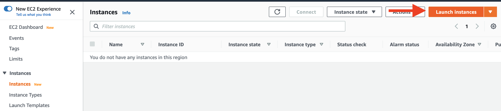

2. Select an Amazon Machine Image (AMI) to use. Enter **ami-00fc61ca97c54fe15** in the search box and select the AMI **AWSWordpressWorkshop - ami-00fc61ca97c54fe15**.

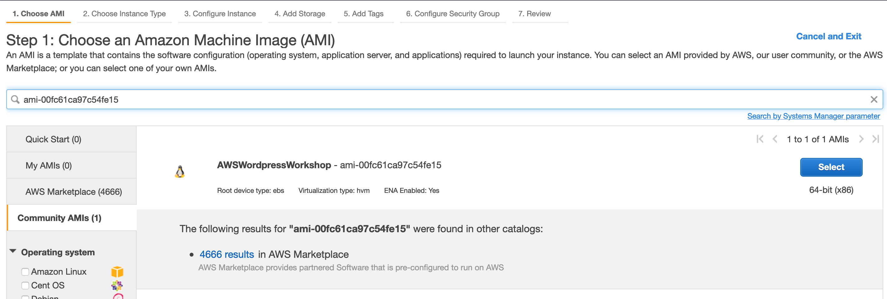


4. Next select the instance type. For this workshop, select the **t2.micro** option. Then click on **Review and Launch**. This instance has 1 vcpu and 1G of memory, which is adequate for a development or test server.  For production, select a larger instance size appropriate for usage projections.

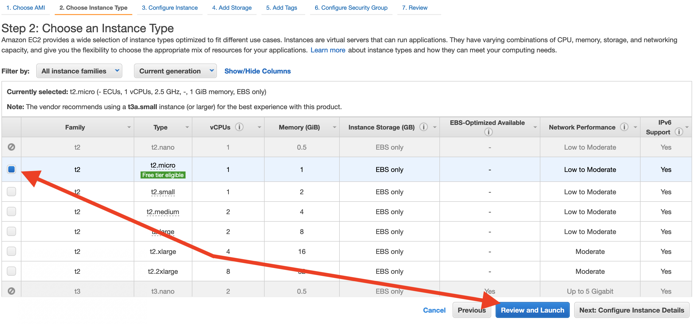

5. You are presented a review of the launch configuration to allow you to verify you are launching what you intended.  Click on **Launch**.

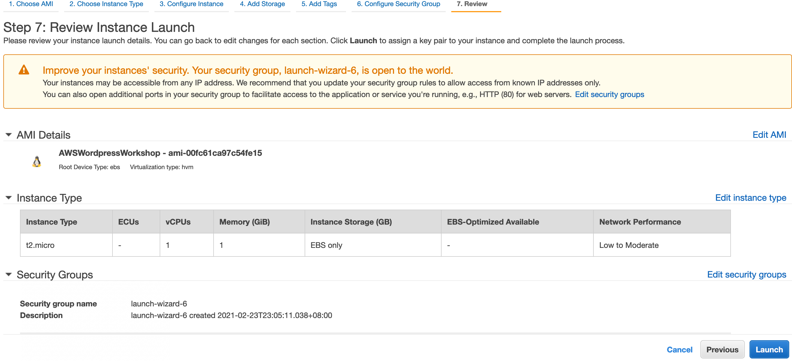

6. The last step before your instance is launched is to create or select a keypair that will be used to allow you to access the instance remotely using SSH.  Select **Create a new key pair** from the dropdown, and then enter a name for the keypair.  You then need to download the key file (.pem) to your local computer.

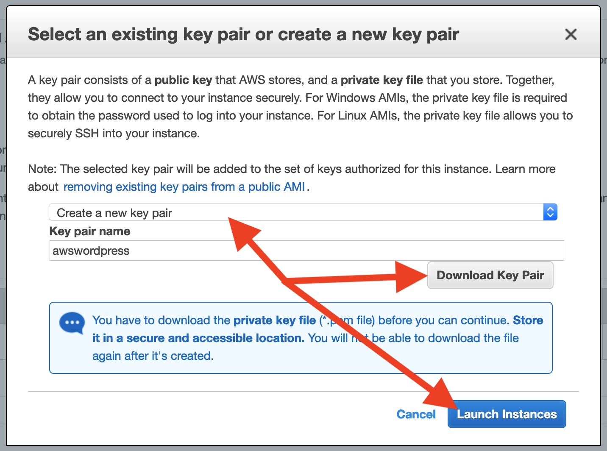

7. Your instance is now launching


8. You can see the status of your instance. Click on the instance ID to see the details of your instance


9. You can view the details of your instance by selecting it in the AWS EC2 Console

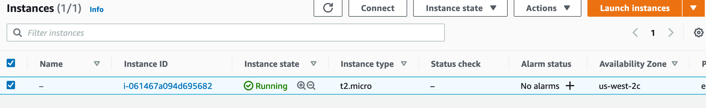

The public IP address of the webserver will be found in the instance details. You will need this information to log into the instance.

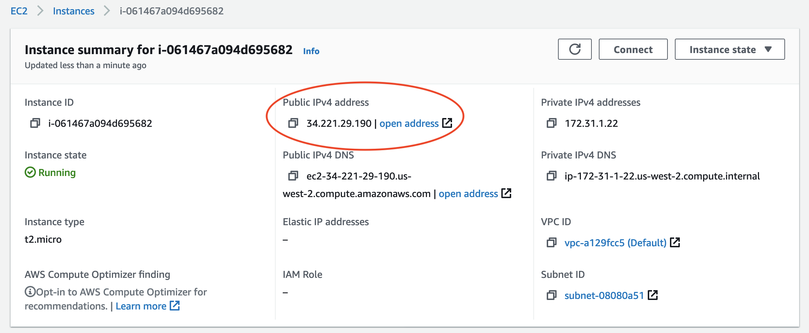

10. Before you can access the WordPress website that is already installed on the instance, you need to update the ***SecurityGroup*** for the instance to allow access to HTTP (port 80). Under the instance details, there is a ***Security*** tab. Click on that tab to see the Security Group that was created when the instance was launched.

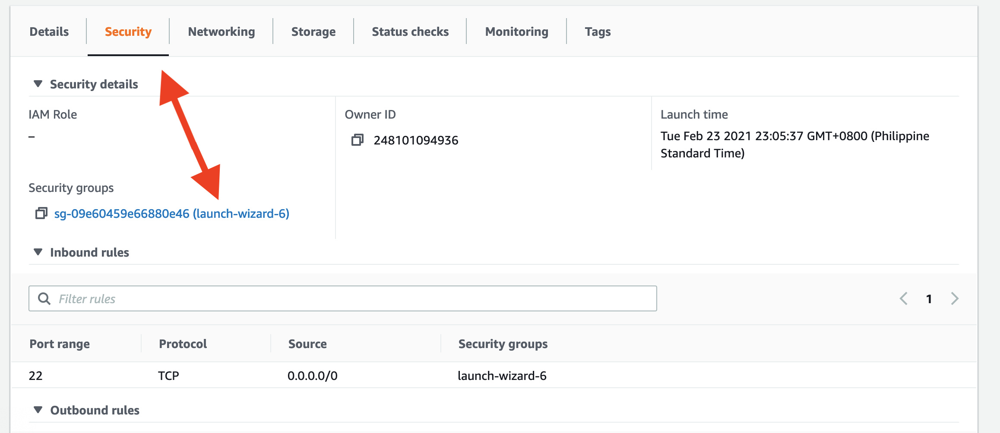

Click on the security group and add a new firewall rule. Click on **Edit Inbound Rules**

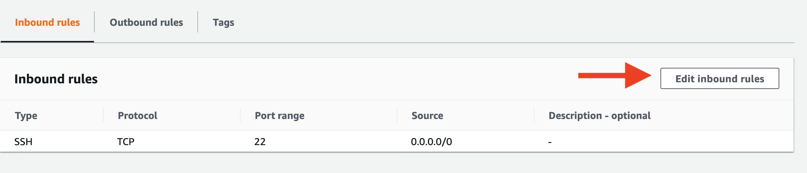

Next, click on **Add Rule** and add the following:

`Type: HTTP`<p>
`Source: Anywhere`<p>

Then click on **Save Rules**

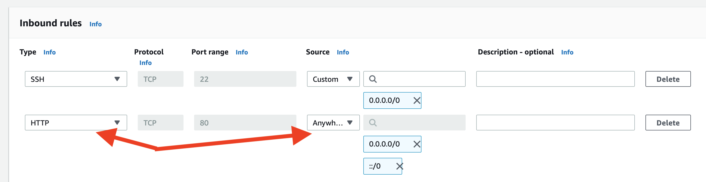

<p>

>
Download the All-In-One WP Migration plug that we will be using in the next steps.  Copy the following into a new web browser window:
`https://github.com/onepagezen/all-in-one-wp-migration-unlimited/archive/master.zip` which will save the file into your Downloads folder on your computer.

<p>

---
>### The Hard Way for Ubuntu, MySQL and Apache ***Advanced***
<details>
   <summary>Click to view the manual steps</summary>

1. Launch EC2 Instance → t2.micro, choose Linux of choice (Ubuntu for example). Follow the same steps as above, but select the desired version of Linux instead of the Bitnami AMI.

2. Connect to server using the public IP address with your preferred SSH client.  You will use the keypair file that you selected or created when you launched the instance. Depending on your SSH client, you might encounter a warning about permissions on the keypair file.  

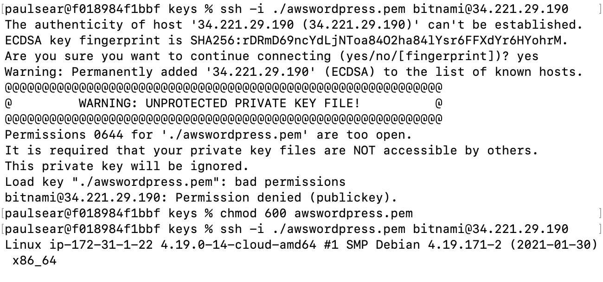

3. Install `mysql-server`. For example, in Ubuntu, `apt-get` is used to install applications. 

>>
```
apt-get install mysql-server
```

4. Create the database in using `mysql`. In this example the database created is **wordpress** and the user created is also **wordpress**.  The use is granted permissions to access and use the database.
>>
```
create database wordpress;
create user 'wordpress'@'localhost' identified by 'AWSworkshop';
grant all privileges on *.* to 'wordpress'@'localhost';
flush privileges;
```
5. Download the WordPress application to the server and then extract the files. Next copy the files to your web server document root.  For example, the default with Apache2 will be `/var/www/html`
>>
```
wget https://WordPress.org/latest.tar.gz
tar -xzvf latest.tar.gz
cp wordpress/* /var/www/html
```
6. Configure `wp-config.php` with the appropriate information for the database connection as well as ***secret keys*** used by WordPress.  For more information on how to configure `wp-config.php`, read [https://wordpress.org/support/article/editing-wp-config-php/](https://wordpress.org/support/article/editing-wp-config-php/)

```
nano /var/www/html/wp-config.php
```

7. Run the WordPress installer to complete the WordPress installation: `http://example.com/wp-admin/install.php`
 
</details>

<p>

---
<p>

12. Log into the WordPress Console for the website using the IP address of the AWS instance. For example, 
http://ipaddress/wp-login.php where **ipaddress** is the public IP address of the server which can be found in the details of the instance. Use the following credentials to log into the WordPress Admin Portal:

>Login: `wordpress`<p>
>Password: `AWSworkshop`<p>

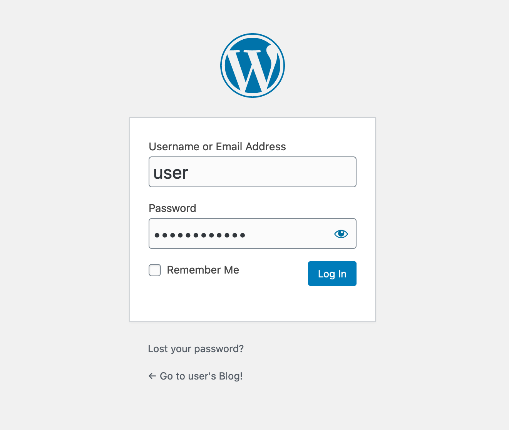


13. Once logged into the WordPress console, you will need to install a WordPress plugin that will be used to import the data and files from the source website.  This plugin is called **All-In-One WP Migration** and you will install it using from the source file.  Navigate the the menu on the left and expand the section **Plugins** and select **Add New** as show here:


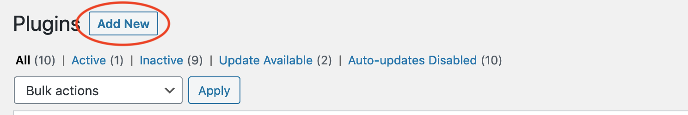


Use the following URL for the plugin: `https://github.com/onepagezen/all-in-one-wp-migration-unlimited/archive/master.zip`

Once the plugin is installed, click on **Activate** to use it in the WordPress Admin Portal.

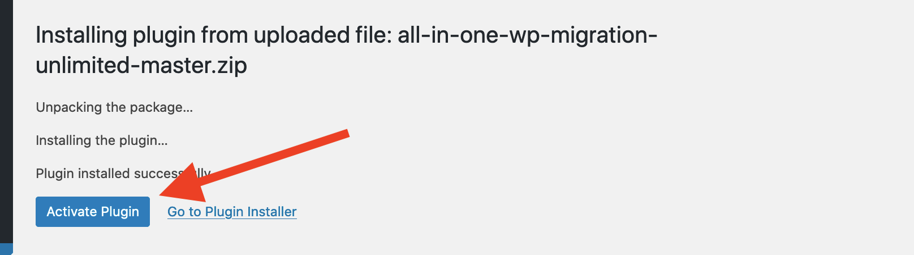


14. Now that the plugin is activated, you will export the files and data from the **source** website. Don't close your browser window!


## Preparing the source

To migrate your  WordPress website, you need to extract a copy of the data stored in the database and all files that are a part of the WordPress website.  Normally this would be complicated and involve many manual steps, but fortunately, there are plugins and tools that will assist with this.  For this workshop we will be using the **All-In-One WP Migration** Plugin to extract the database and files you will need to import into the new website

1. To begin the exporting of the data and files from the **source** website, in a ***new browser window***, log into the website you want to migrate by logging into the WordPress Admin portal.  This will typically be found at http://yourwebsite/wp-admin/
Log in with a user that has admin level privileges.  

***For this workshop use the following information:***

>Url: `http://142.47.107.210/wp-admin/`<p>
>Login: `wordpress`<p>
>Password: `AWSworkshop`<p>

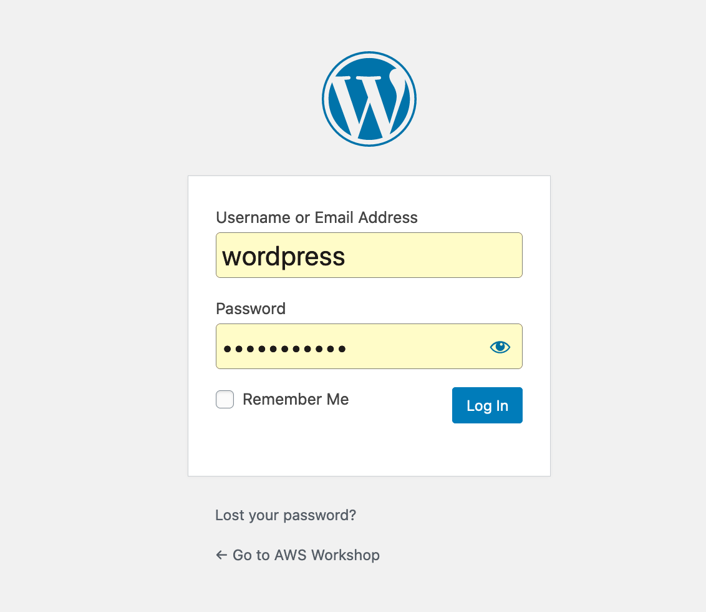

This website already has the plugin installed. You will use this plugin to export the files and data into an archive that you will download to your local computer.

On the left side of the WordPress Admin Portal, you will see a section **All-In-One WP Migration**. This is where you will create the export archive. Click on **Export**

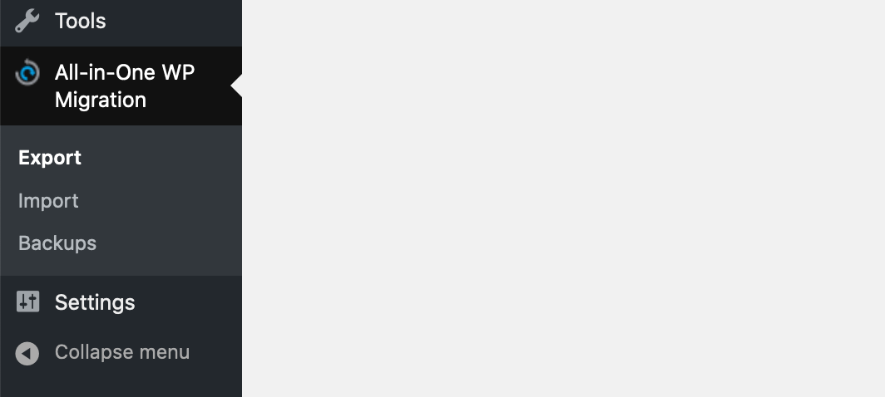

Then click on **Export To** and select **File**

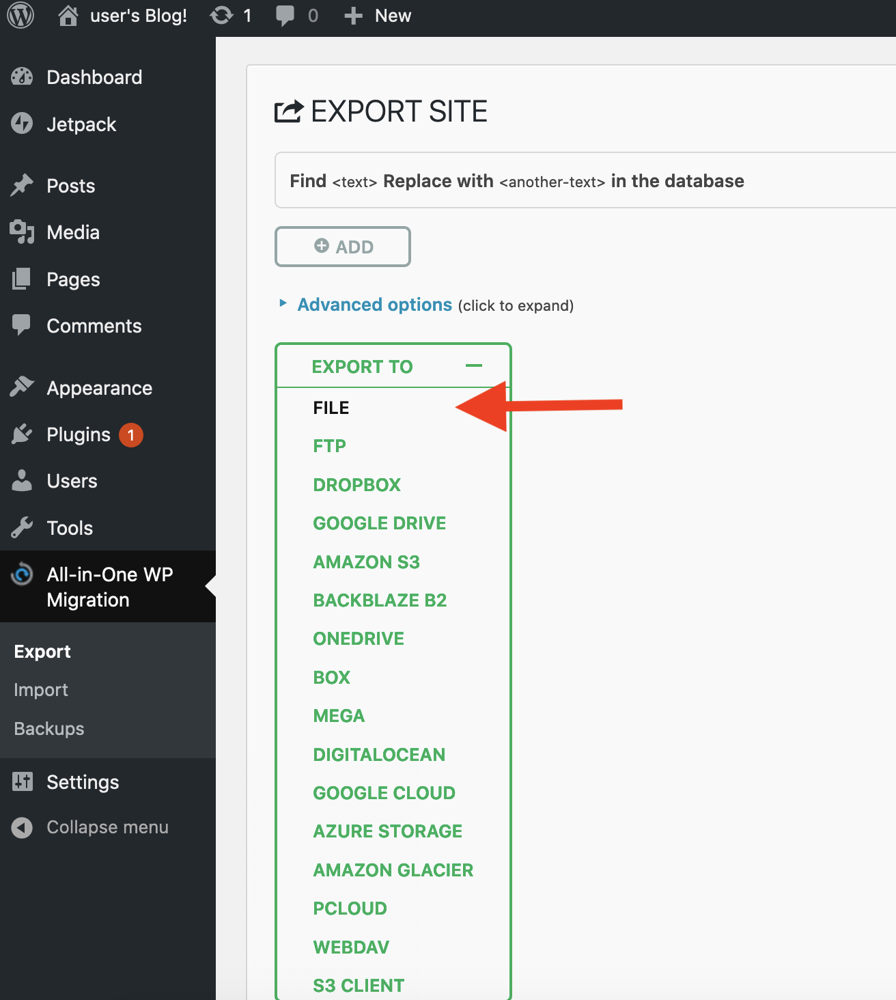

Save the archive by clicking on the Green Box and the archive will be saved to your local computer.

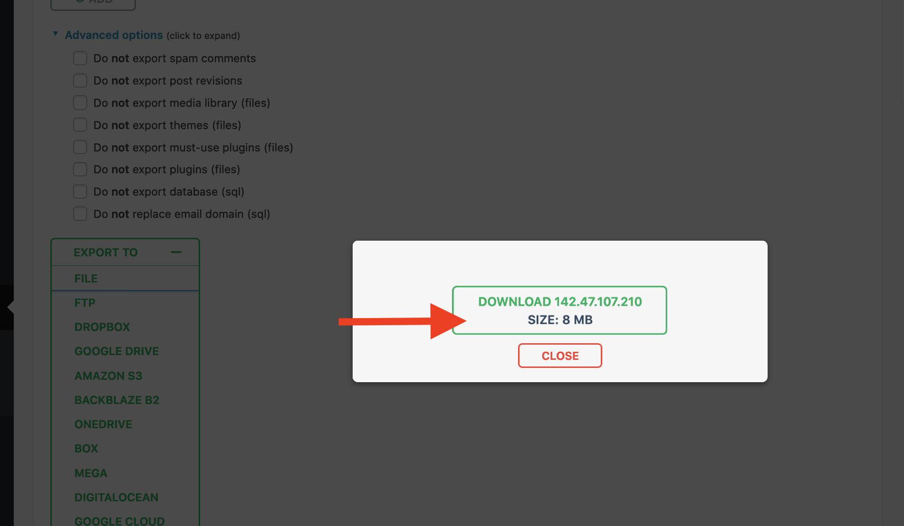

<p>

## Migrate to the AWS Instance

Now that the archive has been downloaded, you will import that archive into the new WordPress site.  
Switch back to the Admin Portal of the **New** website.

In the WordPress Admin Portal, select **All-In-One WP Migration** on the left side, and the click on **Import**

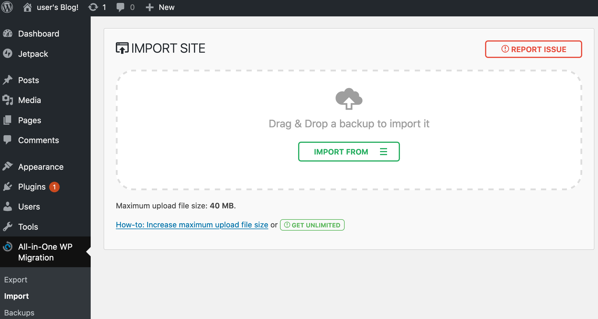

A status bar will display the progress of the archive import

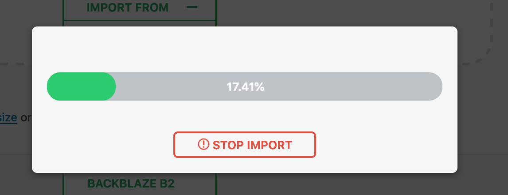

Once the import completes, you will be notified that this import will over-write any existing data and WordPress configuration. 

## Clean Up

At this point you now have a new WordPress website running on an AWS Instance that is identical the original website.  There are a few remaining steps you will need to do to complete the migration.

1. Validate that the website was imported correctly and that everything works as you expect. Adjust any WordPress settings as appropriate.

2. You will need to update the DNS information for your website to use the IP address of the new WordPress instance running in AWS.

3. Finally you can shutdown the server hosting the original website.


## 

## 


